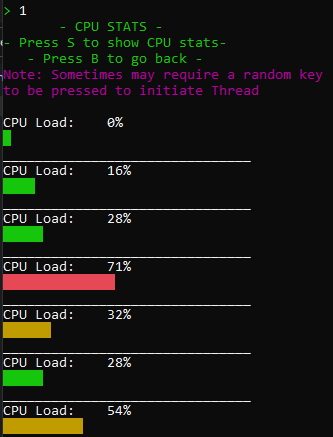
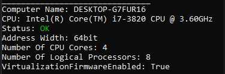
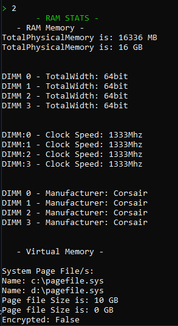
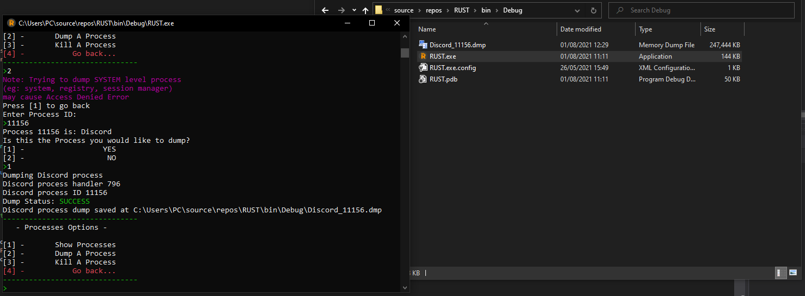
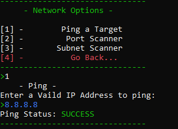
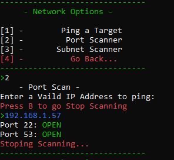
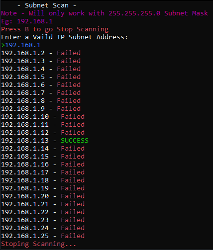

# RUST

RUST is a general-purpose computer tool coded in C# with the .NET Framework.

  
RUST is a command line interface tool were the user mainly navigates using numbers and the enter key.
#### Main Menu:

### Features:
Some of the notable features of the program are:
(Some brief screenshots are also provided)
* CPU/RAM Stats and Details
	* Live CPU load Bars:
	* 
	* CPU Info:
	* 
	* RAM Info:
	* 
* Showing Running Processes
    * Be able to select a process using the PID and create a dump(.dmp) from memory automatically.
    * 
    * Dump Process:
    * 
    * Select a process using its PID and Kill it
* Network Scanner
	* Enter a target IP address and automatically try to ping it 
	* 
	* Enter a target IP address and automatically scan which ports are open
	* 
    	* Enter an Network IP address (with subnet mask 255.255.255.0) and preform a subnet scan of client IP from .2 -> .255 on the network to see which are able to ping back. 
    	* 

#### About:
* Author: Mateusz Peplinski
* Date v.10 Published: 01/08/2021
* License: MIT 
© 2021 Mateusz Peplinski
